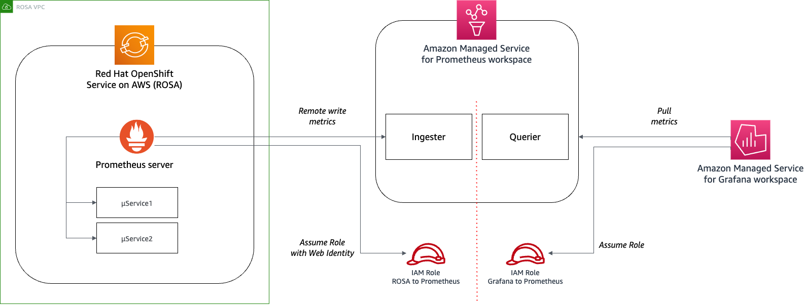

# ROSA with Amazon Managed Service for Prometheus and Amazon Managed for Grafana

## Solution Architecture



## Deployment

### Pre-requisites

- [CDK CLI](https://docs.aws.amazon.com/cdk/v2/guide/getting_started.html#getting_started_install)
- ROSA enabled in your AWS account, and a [ROSA cluster with STS](https://docs.aws.amazon.com/ROSA/latest/userguide/getting-started-sts-auto.html)
- [oc CLI](https://docs.openshift.com/container-platform/4.8/cli_reference/openshift_cli/getting-started-cli.html)
- [Helm CLI](https://helm.sh/docs/intro/install/)

### Step 1 - CDK Deployment

1. Login in into your ROSA cluster

```bash
oc login  <cluster-api-endpoint> --username <username> --password <password>`
```

1. Create the Amazon Managed Service for Prometheus and Grafana workspaces:

```bash
export ROSA_OIDC_PROVIDER=$(oc get authentication.config.openshift.io cluster -o json | jq -r .spec.serviceAccountIssuer| sed -e "s/^https:\\/\\///")

cdk deploy --parameters rosaOidcEndpoint=${ROSA_OIDC_PROVIDER} --parameters rosaServiceAccount=prometheus-aws --outputs-file ./cdk-outputs.json
```

### Step 2 - Prometheus server installation

1. Add the operator to your Helm repositories by running the following commands:

```bash
helm repo add prometheus-community <https://prometheus-community.github.io/helm-charts>
helm repo update
```

1. Retrieve the stack outputs from the cdk-ouputs.json file generated during the CDK deployment and store them as environment variables:

```bash
export AMP_RW_URL=$(cat ./cdk-outputs.json | jq -r .AmgAmpStack.oAmpRwUrl)
export AMP_REGION=$(cat ./cdk-outputs.json | jq -r .AmgAmpStack.oAwsRegion)
export AMP_ROLE_ARN=$(cat ./cdk-outputs.json | jq -r .AmgAmpStack.oAmpRoleArn)
```

1. Install the Prometheus server in a new OpenShift project via Helm with the following commands:

```bash
oc new-project prometheus-aws
oc adm policy add-scc-to-user anyuid -z prometheus-aws

helm install prometheus-rosa prometheus-community/prometheus \
    --namespace prometheus-aws \
    --values ./prometheus-aws.yaml \
    --version 19.2.2
```

1. Once the deployment is completed, you should see 2 replicas of the Prometheus server:

```bash
$ oc get pod -n $ROSA_SERVICE_ACCOUNT_NAMESPACE

NAME                                                  READY   STATUS    RESTARTS   AGE
prometheus-rosa-server-9797669f5-x9pw7                2/2     Running   0          3d15h
```

### Step 3 - Grafana configuration and access

- Use the Grafana workspace URL to [login in Grafana](https://docs.aws.amazon.com/grafana/latest/userguide/authentication-in-AMG.html).
- In Grafana, click on the AWS menu icon > Data Sources
- From the list of available AWS data source, select Amazon Managed Service for Prometheus
- Configure your the Prometheus data source by providing the following details:

  - Name: ROSA
  - HTTP > URL:
    - In the AWS Console, go to the Amazon Prometheus service
    - Copy from the Prometheus Endpoint - query URL
    - Modify the copied URL to only keep the address until the Workspace ID (ignore this part of the URL /api/v1/query). For example:
      - <https://aps-workspaces.ap-southeast-2.amazonaws.com/workspaces/ws-71912e51-4df5-4aba-81da-sds283c54d54>
  - Auth > SigV4 auth: Enabled
  - SigV4 Auth Details > Default region: use the AWS region code where you Amazon Managed Service for Prometheus is deployed

- Click on the Save & test button, then Explore.
- Choose a metric from the Metrics browser and Run the query

### Clean up

```bash
helm uninstall prometheus-rosa -n prometheus
oc delete ns prometheus
cdk destroy
```
