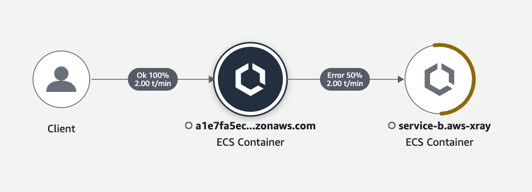

# rosa-xray

ROSA adaptation of an AWS blog post on how to run [X-Ray on Kubernetes](https://aws.amazon.com/de/blogs/compute/application-tracing-on-kubernetes-with-aws-x-ray/).

## Pre-requisites

- [CDK CLI](https://docs.aws.amazon.com/cdk/v2/guide/getting_started.html#getting_started_install)
- ROSA enabled in your AWS account, and a [ROSA cluster with STS](https://docs.aws.amazon.com/ROSA/latest/userguide/getting-started-sts-auto.html)
- [oc CLI](https://docs.openshift.com/container-platform/4.8/cli_reference/openshift_cli/getting-started-cli.html)

## Step 1 - CDK Deployment

1. Login in into your ROSA cluster

```bash
oc login  <cluster-api-endpoint> --username <username> --password <password>`
```

1. Create the IAM role required for the ROSA service account

```bash
cd xray-iam/
export ROSA_OIDC_PROVIDER=$(oc get authentication.config.openshift.io cluster -o json | jq -r .spec.serviceAccountIssuer| sed -e "s/^https:\\/\\///")
cdk deploy --parameters rosaOidcEndpoint=${ROSA_OIDC_PROVIDER} --parameters rosaServiceAccount=xray-daemon --outputs-file ./cdk-outputs.json
export AWS_REGION=$(cat ./cdk-outputs.json | jq -r .RosaXrayStack.oRosaXrayAwsRegion)
export AWS_ROLE_ARN=$(cat ./cdk-outputs.json | jq -r .RosaXrayStack.oRosaXrayRoleArn)
```

## Step 2 - X-Ray Deployment

```bash
cd xray-daemon/
envsubst < xray-k8s-daemonset.yaml | oc apply -f -
```

Verify that the X-Ray daemon is running successfully:

```bash
oc get pods -n aws-xray
oc get daemonset
```

## Step 3 - Demo apps

```bash
cd demo-app/
oc apply -f k8s-deploy.yaml
```

Find the service-a EXTERNAL-IP of the load balancers created to expose the 2 demo services:

```bash
oc get svc
```

Once the load balancers are provisioned, you can send request to the services to generate traces in X-Ray:

- `service-a` exposes 2 endpoints:
  - GET `curl http://<service-a-lb-dns-name>/health` which should returns a 200 if the service is running
  - POST `curl http://<service-a-lb-dns-name>` which calls the `service-b` POST `/create` endpoint
- `service-b` exposes 2 endpoints:
  - GET `curl http://<service-b-lb-dns-name>/health` which should returns a 200 if the service is running
  - POST `curl -X POST http://<service-b-lb-dns-name>/create` which randomly generates 403 and 200 HTTP code responses

After sending requests to `service-a`, you should expect to see ~ 50% of the request showing errors:



Note: you can ignore the mentions of ECS. Currently the [AWS X-Ray SDK for Node.js](https://docs.aws.amazon.com/xray/latest/devguide/xray-sdk-nodejs.html) supports a limited set of plugins. The ECS plugin is used here to extract the name of the 2 services but is not mandatory.

### Clean up

```bash
oc delete -f demo-app/k8s-deploy.yaml
oc delete -f xray-daemon/xray-k8s-daemonset.yaml
cd xray-iam/ && cdk destroy
```
